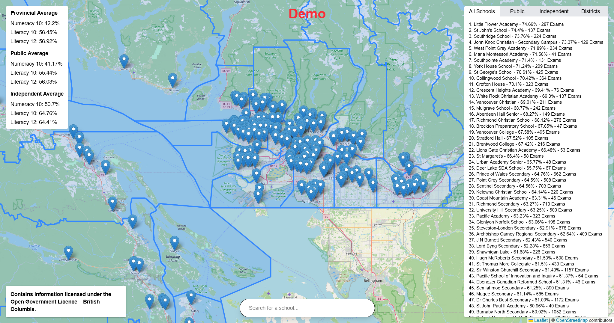

# bcs
<!-- image -->

Interactive viewer for BC school assessment data:
 - Numeracy 10
 - Literacy 10
 - Literacy 12
 - School Rankings (all, public, independent)
 - Provincial Averages (all, public, independent)
 - District Rankings
 - Searchable schools
 - Mobile version (spent too long on this)

Also contains a pipeline to process raw geojson, location, and assessment data from the BC Ministry of Education: [pipeline](./data/process.ts).

This is a working, but not complete project. More changes will come in the form of ui styling and features.

---
Built with next.js & map by leaflet. Data from BC Ministry of Education.

Ai was used to solve parsing errors, mobile flow errors, explanations/learning, and a particularly annoying bug regarding opening/closing popups in the right order.

Code is licensed under MIT, see [LICENSE](./LICENSE).
Data is licensed under the Open Government License - British Columbia, see [data license](https://www2.gov.bc.ca/gov/content/data/open-data/open-government-licence-bc).